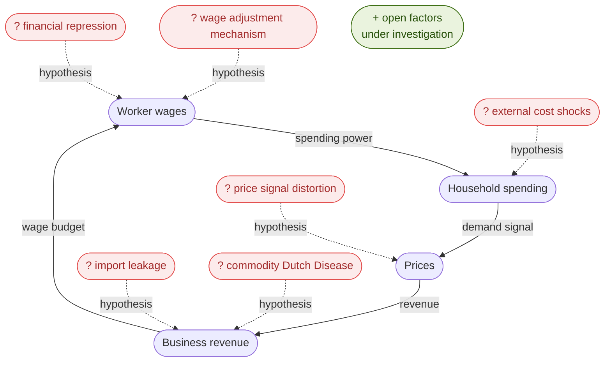

# AI Agent Context — nn

## Name

**nn** — not an abbreviation. Not neural network. Just nn.

---

## What This Is

nn is a **research instrument** for measuring Indonesia's real economic health — not the headline narrative.

Not a startup. Not a dashboard product. Not a think tank report. A measurement project: honest, reproducible, explainable in plain language.

---

## The Core Argument

Indonesia's economic feedback loop is broken. Wages suppressed. Prices capped informally. Factories close. Spending falls. The loop does not self-correct.

The standard policy response — lower prices, control wages — treats symptoms as solutions. The actual need is the opposite: higher incomes that allow higher prices that fund higher wages that sustain real demand.

**Low prices do not help the poor. Controlled wages destroy jobs.** Both feel wrong on first reading. The instrument exists to show why both are true — with data, with rupiah amounts people recognize.

---

## Three Layers

**Ledger** — time series of events. Datestamped, factual. No interpretation. Just the record.

**Cockpit** — instruments reading from the ledger. Current signal state. Built for fast pattern recognition.

**Manual** — knowledge graph explaining why instruments read what they read. Institutional history, structural mechanisms, annotated back to ledger events. This is what makes nn different from any other Indonesia economy tracker.

---

## The Loop

The central subject of nn. The hypothesis: Indonesia's wage-price feedback loop is broken.

The red nodes are **hypotheses under investigation**, not confirmed conclusions. nn exists to test them with data.

**Suspected factors:**
- `F1` — UMR is annual, political, and partial. Covers formal workers only. Creates cliffs not smooth adjustment.
- `F2` — political pressure for "low prices" mutes the price signal. Subsidies, commodity controls, informal pressure on businesses.
- `F3` — spending leaks to imports. Higher consumer spending buys Chinese goods, not domestic factory output. Revenue signal never returns to domestic producers.
- `F4` — commodity booms (coal, palm oil, nickel) strengthen rupiah, cheapen imports, squeeze manufacturers. M2 expands but CPI stays muted — pressure builds invisibly until it snaps.
- `F5` — worker savings suppressed through BPJS → SBN captive buying. Capital cannot accumulate at the bottom.
- `F6` — living costs (housing, education, transport) rise from outside the loop — land speculation, fuel subsidy cuts, global commodity prices. Workers squeezed without the loop running.

**The warkop signal:** kopi warung held at IDR 2,000 for nearly 20 years, snapped to IDR 5,000 in under 3 years (2022–2026). A nonlinear system with input saturation releasing. The accumulation and snap is a measurable variable. It is what nn is built to track.

**The paradox:** candidates promise lower prices. Lower prices kill farmers and factories. The correct target is higher incomes that allow higher prices that sustain real demand. Low prices do not help the poor. Controlled wages destroy jobs. Both feel wrong on first reading. nn exists to show why both are true.

---

## Language Convention

| Layer | Language |
|---|---|
| Code, variable names, docstrings | English |
| Notebook markdown (explanation) | Bahasa Indonesia |
| README.md | Bilingual |
| ROADMAP.md, docs | English now; Bahasa Indonesia when published |

---

## Key Concepts

- **Sektor riil** — production, wages, household spending. Not SBN yields or headline GDP.
- **Sachet economy** — price signals below official CPI: sachets of shampoo, cooking oil, instant noodles.
- **BPS reproducibility anchor** — reproduce their number before diverging from it.
- **Ledger** — time series of events, factual, no interpretation.
- **Cockpit** — instruments reading from the ledger, current signal state.
- **Manual** — knowledge graph explaining why instruments read what they read.

---

## Current Phase

**Phase 1 — Feel the Data.** Notebook-based. BPS raw → BPS published reproduction. No schema design until notebooks teach what the data needs.

---

## Do / Do Not

**Do:** express findings in rupiah, sachets, warung prices. Show residuals. Document what the notebook does *not* do.

**Do not:** treat GDP headline as ground truth. Design architecture before notebooks have run. Suggest visualizations before data is reproduced.